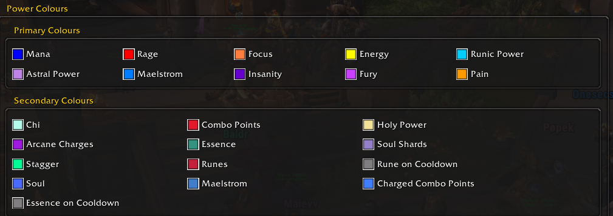

### Both Bottom
Displays both primary and secondary power bars below Essential Frame. Use for Arcane Mage (track mana **and** arcane charges), Feral Druid (energy **and** combo points), etc.

### Primary Bottom
Displays only primary power bar below Essential Frame. Use for Hunters (**only** focus), Warriors (**only** rage), etc.

### Secondary Bottom
Replaces primary power bar with secondary power bar. Use it if you don't care about your primary power (usually mana). 
Compatible with:
- Evoker
  - Devastation
  - Augmentation
- Paladin
  - Protection
  - Retribution
- Warlocks
- Enhancement Shaman

To check which recourses are considered as primary, see:

